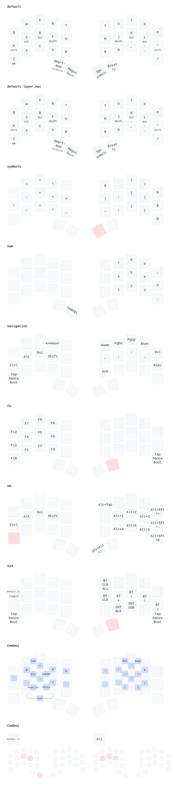

# ZMK Config

Personal [ZMK](https://zmk.dev/) config for a split cradio keyboard with nice!nano v2
controllers.

## Keymap



## Repository Layout

- `config/base.keymap` is the main keymap source.
- `config/cradio.keymap` is the board entry point and physical key-position setup.
- `config/includes/` contains shared behaviors, combos, leader sequences, and macros.
- `config/west.yml` pins ZMK and external modules.
- `build.yaml` defines the GitHub Actions and local build targets.
- `keymap_drawer/` contains the generated keymap drawing and drawer config.
- `Justfile` is the entry point for local build, draw, and update commands.
- `flake.nix` and `flake.lock` pin the local development toolchain.

The local west workspace and build output are intentionally ignored by git: `.west/`, `.build/`,
`firmware/`, `modules/`, `zephyr/`, and `zmk/`. These directories are created by `just init`,
`just sync`, or `just build`; they can be deleted and recreated.

## Local Build Environment

The local build environment uses Nix to provide `west`, the Zephyr SDK, Python build dependencies,
`keymap-drawer`, `just`, and `pin-west`. This keeps the ZMK toolchain pinned and separate from the
rest of the system.

Using it is optional. Pushing changes to GitHub runs the firmware build workflow in Actions, which
requires no local ZMK setup.

Install Nix first if `nix develop` is not available:

```sh
curl --proto '=https' --tlsv1.2 -sSf -L https://install.determinate.systems/nix |
  sh -s -- install --no-confirm
```

Start the Nix daemon in the current shell without restarting:

```sh
. /nix/var/nix/profiles/default/etc/profile.d/nix-daemon.sh
```

Enter the pinned shell with `nix develop` when working locally.

### Usage

`just` is the entry point for common local tasks. Running `just` without arguments lists all
available recipes.

### First-Time Setup

From inside `nix develop`, run `just init` once to initialize the west workspace. This wraps
`west init -l config`, `west update --fetch-opt=--filter=blob:none`, and `west zephyr-export`.
After manifest changes, refresh the existing workspace with `just sync`.

### Building Firmware

To build firmware for both halves, run `just build all`. This parses `build.yaml` and builds every
board and shield combination listed there. Compiled firmware is copied into the `firmware/`
directory.

To build only one matching target, use `just build <target>`. In this repo, `just build
cradio_left` builds the left cradio shield for `nice_nano_v2`, and `just build cradio_right` builds
the right half. `just list` shows all valid targets.

Additional arguments to `just build` are passed on to `west`, so a pristine build can be triggered
with `just build all -p`. Alternatively, `just clean` removes the local build cache and copied
firmware artifacts.

Successful builds write `firmware/cradio_left-nice_nano_v2.uf2` and
`firmware/cradio_right-nice_nano_v2.uf2`.

### Flashing Firmware

The nice!nano v2 uses UF2 firmware. To flash a cradio half, put that controller into bootloader
mode and copy the matching `.uf2` file from `firmware/` onto the mounted bootloader drive. Use
`firmware/cradio_left-nice_nano_v2.uf2` for the left half and
`firmware/cradio_right-nice_nano_v2.uf2` for the right half.

For boards that do not use UF2, `just flash <target>` builds the matching target first and then
runs `west flash` against its build directory.

### Drawing The Keymap

Run `just draw` to regenerate the committed keymap drawing. This parses `config/base.keymap`, writes
`keymap_drawer/base.yaml`, and renders
`keymap_drawer/base.svg`.

If the draw workflow fails with a `git diff --exit-code` error, the generated artifacts are stale.
Run `just draw`, inspect the diff, and commit the updated `keymap_drawer/base.yaml` and
`keymap_drawer/base.svg`.

### Updating Pins

Use `just check-west` to verify that `config/west.yml` revisions are exact pins. Use `just
bump-west` to bump ZMK and module pins, then inspect the resulting `config/west.yml` diff before
committing.

Use `just bump-nix` to bump the Nix toolchain pins. Use this carefully: Nix package updates can
break Zephyr Python dependencies. After bumping, test with `just list` and `just build cradio_left`.

### Cleaning Local Output

Run `just clean` to remove local build output. If you want to remove the whole generated west
workspace from your local checkout:

```sh
rm -rf .west .build firmware modules zephyr zmk
```

Run `just init` again before the next local build.

## GitHub Actions

- `.github/workflows/build.yml` builds the firmware using ZMK's reusable workflow.
- `.github/workflows/draw.yml` regenerates the keymap drawing through `nix develop --command just draw`.
- `.github/workflows/test-build-env.yml` smoke-tests the local Nix/Just workflow on Actions.
